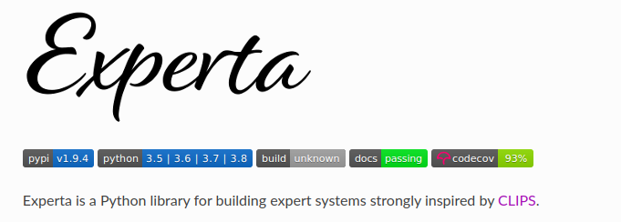

# Proyecto final del curso de Fundamentos de Inteligencia Artificial

## Universidad Nacional de Ingenieria

**Este proyecto presenta el desarrollo de un sistema de apoyo a decisiones para la selección de personal de prácticas, integrando un chatbot basado en inteligencia artificial. El sistema evalúa a los postulantes según sus habilidades blandas y duras, así como sus certificaciones, aplicando reglas específicas para diferentes áreas laborales como TI, Marketing, Operaciones, Recursos Humanos y Finanzas. Utilizando la biblioteca experta en Python, se gestionó un motor de reglas que facilita la toma de decisiones, asegurando una selección precisa y eficiente de los candidatos más adecuados para cada puesto. El sistema permite la entrada de datos de postulantes de manera interactiva, evaluándolos en tiempo real y ajustando dinámicamente las evaluaciones según las necesidades específicas de cada área de la empresa. Este enfoque optimiza el proceso de reclutamiento, reduciendo costos y tiempo, y mejorando la precisión en la identificación de candidatos idóneos. Los experimentos realizados demostraron la eficacia del sistema en diferentes escenarios, confirmando su capacidad de apoyo a la gestión del talento en las organizaciones.**

Para la etapa de experimentación, se implementó todos los criterios descritos en la sección 5 de Diseño del agente y de la sección 06 Componentes del agente. Esta implementación se realizó en Python usando la librería EXPERTA, que es la librería para trabajar con sistemas expertos en Python. Esta librería se basa en el sistema CLIPS que también aborda el tema de sistemas expertos.

**# Experimento  Ingreso al área de TI.**

Para los postulantes a de TI en el sistema evalúa a los postulantes mediante un conjunto de condiciones, estas reglas se muestran en la tabla 05. Se activa si la empresa tiene vacantes en el área de TI y el postulante ha aplicado para esa área. Además, el postulante debe poseer habilidades duras en desarrollo de software, seguridad informática y gestión de redes, así como habilidades blandas en comunicación y trabajo en equipo. Si todas estas condiciones se cumplen, el postulante es considerado para la vacante en TI.

